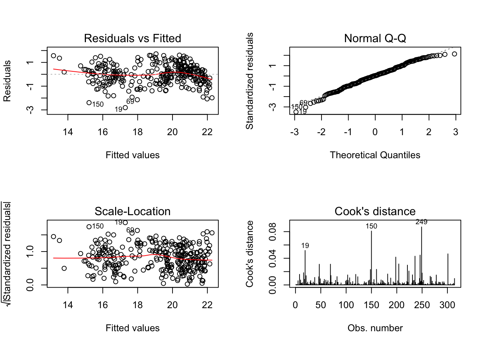

# Seoul Bikes Rental Demand with R 

This repository contains notebooks of analyzing and building multiple regression models for the Seoul Bike Sharing System.

# Introduction

The purpose of this project is to accurately predict rental bike demand on each day on factors such as weather and holiday season. This will help the public lessen the waiting time and enhance the comfort in urban cities. Several other factors such as workday and holiday also affect bike demand other than the weather conditions (Kim, 2018) and therefore, I am interested in **how integrating different variables will change the prediction accuracy**. Accurately predicting the bike counts required for stable supply is a major concern as convenience plays a crucial role in people continuing using the services (Sathishkumar, Jangwoo, and Yongyun, 2020). Therefore, the project aims to **predict demand for bike rental demands during am hours and pm hours as well as hourly and daily demands**. This will help rental companies to have an idea of **how many bikes should be available to meet the demand of the public on any given day**. It will also help the company schedule bike maintenance times just in time for the demand.

Chen (2003) stated that regression based algorithms cannot predict the bike demand accurately. However, regression algorithms are comparatively faster at predicting large datasets than most other machine learning methods. Linear regression also does not assume normality of the dataset. As our data is **very skewed** in some factors, it is still valuable to see how the model performs. Therefore, we aim to predict bike demand **using different regression algorithms to test the prediction accuracy and limitations**.

# Dataset and Source

This Dataset is taken from UC Irvine Machine Learning Repository: Seoul Bike Sharing Demand Dataset at [link](https://archive.ics.uci.edu/ml/datasets/Seoul+Bike+Sharing+Demand). The dataset has **8760 data points** and each of them are **representing weather and holiday** information which are possible major factors in hiring a bike. The time span of the dataset is 365 days and weather information and bike demand data is given for each hour.

Features of the dataset:

- The dataset contains 14 attributes. 10 numerical and 3 categorical and 1 time series values.

- Target values: Rented Bike count - Count of bikes rented at each hour

Feature attributes: 
- Date : year-month-day 
- Hour - Hour of he day 
- Temperature-Temperature in Celsius 
- Humidity - % Wind Speed - m/s Visibility - 10m 
- Dew point temperature - Celsius Solar radiation - MJ/m2 
- Rainfall - mm 
- Snowfall - cm 
- Seasons - Winter, Spring, Summer, Autumn 
- Holiday - Holiday/No holiday 
- Functional Day - No(Non Functional Hours), Yes(Functional hours)

# Method
Some assumptions are made during handling of the Bike Dataset. These are
- More demand on holidays despite bad weather conditions. 
- Less demand on very cold and very hot days. 
- Wind speed will be inversely proportional to the demand. 
- More demand during hotter seasons such as summer and spring. 
- Considerably less demand on rainy days. 
- More demand during week-end than during weekdays. 

These will be tested during the data exploration stage. The data is splitted to 80-20 to minimise overfitting and to test the prediction accuracy of the model.

Also, there are 4 regression models in this report predicting bike rental demands.

- Model 1 - Multiple linear regression model predicting bike rental demand for **every hour** using **hourly weather conditions**. 
- Model 2 - Multiple linear regression model predicting bike rental demand using **average daily weather conditions**. 
- Model 3 - Multiple linear regression model predicting bike rental demand **during am hours and pm hours**. 
- Model 4 - Multiple linear regression model predicting bike rental demand for **every day with weekend column** and using **daily average weather conditions**.

The dataset is already clean and therefore, data preprocessing steps such as removal of outliers and handling of missing values are not performed before fitting into the models. As regression models do not assume normality of the data, the dataset is used as it is without any transformation. Categorical columns, hours, seasons, holiday and functional day are set as factors before fitting into the models. All the feature attributes of the dataset, except functioning day, is used to predict bike demand in all the models.

For each of the models, the dataset is splitted and then fit into the regression model. Then the optimum model is calculated using the stepwise regression method and **VIF regression** to test multicollinearity. Then statistical tests such as the **non-constant error variance** test to check homoscedasticity of the model, **Cook’s distance** to check outliers, **Durbin Watson test** for autocorrelation and **Shapiro-Wilk tests** for normality, are performed to check if the model is adequate. If the model fails the tests, especially for homoscedasticity, **Box-Cox transformation** is performed on the model. Then outliers are removed and the data is then fitted to model again and tested for adequacy. Shapiro-Wilk test is performed only on datasets less than 5000 points.

# Result
Out of all the models, **Model 4 is shown to be the most reliable and accurate at predicting bike demand by passing all the requirements except normality of residuals**. As expected, ‘weekend’ plays a factor in the prediction of bike demand and Model 4: predicting bike rental demand for everyday with added ‘weekend’ feature gives the best prediction of bike demand, giving the **accuracy of 87.69%**. For normality assumption of regression we will consider that since the dataset is not too small, the p-value is not too much smaller than 0.05 and from **QQ-plot we can see that most of the residuals are on the dotted lines**. Moreover, model 4 passes the rest of the tests, we conclude that Model 4 can adequately predict the bike demand. It may also be valuable to add on other transformation methods such as min-max transformation after box-cox transformation on the model to see whether models that failed adequacy tests will give adequate models.

# Conclusion
Even though regression models could not predict hourly bike demand as accurately as other machine learning models and deep learning models, the accuracy for predicting daily bike demand is considerably strong. However, this model can only predict daily bike demand instead of hourly, which may be more valuable for the bike hire companies. This means other machine learning techniques may be more suitable for the purposes of the bike hire companies. However, predicting daily bike demand is still valuable as this can help in activities such as scheduling bike servicing scheduling, seasonal bike stockings and profit optimisation. We did not test for adding the weekend factor for the hourly bike demand prediction model. This may increase the accuracy and adequacy of the model therefore, should be further tested. Recent studies have also found that other factors such as infrastructure of the bike paths and accessibility of the stations (El-Assi, Mahmoud, & Habib, 2017). If these factors are also accounted for in the model, we may be able to improve the prediction accuracy.

# References:
Chen, T. (2003). A fuzzy back propagation network for output time prediction in a wafer fab. Applied Soft Computing, 2(3), 211–222. [doi:10.1016/S1568-4946(02)00066-2](doi:10.1016/S1568-4946(02)00066-2)

El-Assi, W., Mahmoud, M.S., & Habib, K.N. (2017). Effects of built environment and weather on bike sharing demand: A station level analysis of commercial bike sharing in Toronto. Transportation, 44(3), 589–613. [doi:10.1007/s11116-015-9669-z](doi:10.1007/s11116-015-9669-z)

Kim, K. (2018). Investigation on the effects of weather and calendar events on bike-sharing according to the trip patterns of bike rentals of stations. Journal of Transport Geography, 66, 309–320. [doi:10.1016/j.jtrangeo.2018.01.001](doi:10.1016/j.jtrangeo.2018.01.001)

Sathishkumar, V. E., Jangwoo, P., and Yongyun, C., 2020. ‘Using data mining techniques for bike sharing demand prediction in metropolitan city.’ Computer Communications, Vol.153, pp.353-366.

